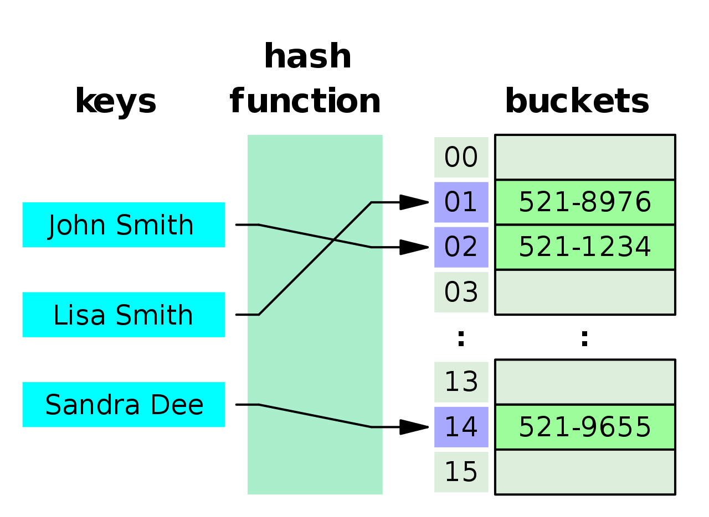

# Hash Table

## Hash Table

- 컴퓨팅에서 key를 value에 mapping 할 수 있는 구조
- 해시 테이블은 각각의 key값에 해시함수를 적용해 배열의 고유한 index를 생성하고 이 index를 활용해 bucket이나 slot의 배열로 계산한다
- 여기서 실제 값이 저장되는 장소를 bucket 또는 slot이라고 한다. JS의 Object, Python의 dictionary가 있다.
  - bucket: 하나의 주소를 갖는 한 구역
  - slot: 한 개의 레코드를 저장할 수 있는 공간, 한 버킷 안에 여러 개의 슬롯이 있을 수 있다.
- Hash Table의 조회, 추가, 삭제의 시간 복잡도는 O(1)으로 굉장히 빠르다.

## Hash Table의 구조

- Hash Table은 내부에 Array 구조와 Hash Function을 사용
- Hash Function: key를 입력했을 때 특정 원리를 이용해 내부 Array의 index로 변환해주는 함수
- ex)

## Hash Table Collision

- 서로 다른 key값에 대해서 hash function의 결과(index)가 같은 값이 나올 수가 있는데 이런 상황을 collision이라고 한다.
- 이 상황에는 버킷 안에 여러 개의 슬롯으로 저장하게 되는데, 해당 인덱스를 탐색 후 그 내부에서 선형검색을 이용해 값을 찾게 된다. 따라서 Hash Table의 시간복잡도가 O(N)까지 증가할 수도 있다. (그래도 시간복잡도에 대해서는 O(1)이라고 대답하는 편)

| key  | index | value                                                    |
| ---- | ----- | -------------------------------------------------------- |
| John | 3     | { John: john's value }                         |
| Lisa | 3     | { John:john's value,  Lisa:Lisa's value } |

자주 사용하는 데이터를 cache에 적용하면 hash table의 효율을 높일 수 있다.

## 충돌 해결방법

__Chaining__

- 연결리스트를 할당하여 버킷에 데이터를 삽입
- 해시 충돌이 발생하면 연결리스트로 데이터들을 연결
- 체이닝의 경우 버킷이 꽉 차더라도 연결리스트로 계속 늘려가기에 데이터의 주소값은 바뀌지 않음
- 장점
  - 해시 테이블의 확장이 필요 없음
  - 간단하게 구현 및 삭제가 가능
- 단점
  - 데이터의 수가 증가함에 따라, 캐시의 효율성이 감소(선형적으로)

__개방 주소법(Open Addressing)__

- 해시 테이블의 공간을 활용하는 방법

- 포인터가 필요 없고 지정한 메모리 외 추가적인 저장 공간도 필요 없다.

- 삽입, 삭제 연산에 오버헤드가 적고, 데이터가 적을 수록 효율이 좋다.

- Linear Probing

  - 해시 충돌시 일정한 step만큼의 버킷을 건너뛰어 데이터를 삽입
  - 장점: 구조가 간단하고 캐시의 효율이 좋음
  - 단점: 최악의 경우 해시테이블 전체를 검색해야 하는 상황이 발생, 데이터의 클러스터링에 가장 취약(특정 위치에 값이 몰리는 현상)
  - 삭제시 삭제를 했다는 표시를 해야한다, 그렇지 않으면 삽입, 검색이 뒤틀림

- Quadratic Probing

  - Linear Probing과 달리 일정 step이 아니라 보폭을 제곱으로 저장하는 방식

  - i번째 해쉬함수에 대해
    $$
    h_i(x)=(h(x)+c_1i^2+c_2i^2)\;mod\;m
    $$
    
  - 데이터 클러스터링을 어느 정도 제거하는 방법
  - 같은 해시값을 갖는 키에 대해서는 2차 클러스터링 문제 발생
  - 캐시 효율과 클러스터링 방지 측면에서 Linear Probing과 Double Hasing 중간 정도의 성능
  
- Double Hashing

  - 충돌 발생시, 다른 함수를 한 번 더 적용한 결과를 이용
  - 캐시 효율은 떨어지지만 클러스터링에 영향을 거의 받지 않음
  - 가장 많은 연산량을 요구
  - 추가로 적용하는 함수의 값은 해시 크기와 서로소인 값을 사용해야 최대 효율을 낸다.

__Resizing__

- 새로운 배열에 기존 배열의 키를 새롭게 재 해싱하는 것

- 개방주소법에서 사용되는 고정 크기의 배열이 가득 차거나 체이닝의 연결 리스트가 길어지게 되면 검색 효율이 떨어지기 때문에 버킷의 갯수를 늘려주는 방법

  

# 트리

## 이진 트리

- 각각의 노드가 최대 두 개의 자식 노드를 갖는 트리 자료 구조
- 이진 트리는 하나의 튜플 (L, S, R)로 L과 R은 이진 트리 혹은 공집합이고 S는 싱글턴 집합
- 정렬과 검색 알고리즘을 위한 하나의 도구로 사용

## 포화 이진 트리(Perfect Binary Tree)

- 모든 레벨에 노드가 포화상태로 차 있는 이진 트리

## 완전 이진 트리(Complete Binary Tree)

- 포화 이진 트리의 노드 번호 1번부터 n번까지 빈 자리가 없는 이진 트리

## 정 이진 트리(Full Binary Tree)

- 각 내부의 노드가 두 개의 자식 노드를 갖는 순서화된 트리

## 힙(heap)

- 부모 자식 간의 대소 관계는 정의되어 있으나 형제 간의 대소 관계는 정의되지 않은 완전 이진 트리