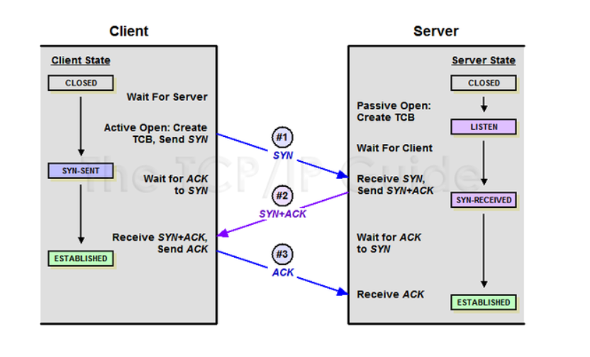

# HTTP GET과 POST 비교

둘 다 http 프로토콜을 이용해서 서버에 무엇인가를 요청할 때 사용하는 방식

## GET

- 요청하는 데이터가 http request message의 header 부분에 url이 담겨서 전송된다. 때문에 url 상에 ? 뒤에 데이터가 붙어 request를 보내게 된다.(query), 이러한 방식은 url이라는 공간에 담겨가기 때문에 전송할 수 있는 데이터의 크기가 제한적이다(256), 또 보안이 필요한 데이터에 대해서 데이터가 url에 노출된다는 문제점이 있다.

## POST

POST 방식의 request는 HTTP Request Message의 Body 부분에 데이터가 담겨서 전송된다.

때문에 바이너리 데이터를 요청하는 경우 POST 방식으로 보내야 하는 것처럼 데이터 크기가 GET 방식보다 크고 보안 면에서 낫다.

## 추가적인 차이점

- GET은 SELECT 적인 성향, POST는 서버의 값이나 상태를 변경하기 위해서 또는 추가하기 위해서 사용
- GET 방식의 요청은 브러우저에서 Caching 할 수 있다. 
  - POST 방식으로 요청할 것을 GET으로 요청한다면 서버가 아닌 기존에 caching 되었던 데이터가 응답될 가능성이 존재한다

# TCP 3-way, 4-way handshake

## 3-way handshaking

1. 클라이언트는 서버에 접속을 요청하는 SYN(a) 패킷을 전송
2. 서버는 클라이언트의 요청인 SYN(a)를 받고 요청을 수락한다는 ACK(a + 1), SYN(b) 패킷을 전송
3. 클라이언트는 서버의 요청 수락 응답인 ACK(a + 1)과 SYN(b)를 받고 ACK(b + 1)를 서버로 보내면 연결이 성립된다.

## 4-way handshaking

1. 클라이언트가 연결을 종료하겠다는 FIN 플래그 전송

2. 서버는 클라이언트의 요청 FIN을 받고 확인 메세지 ACK를 전송

   - 데이터를 모두 보낼 때까지 Time out

3. 서버에서 데이터를 모두 보내고 통신이 끝나면 연결이 종료되었다고 FIN 플래그를 클라이언트에 전송

4. 클라이언트는 FIN 메세지를 확인하고 ACK 를 전송

5. 클라이언트의 상태가 FIN-WAIT => TIME-WAIT로 바뀜

   - Server에서 FIN을 전송하기 전에 전송한 패킷이 라우팅 지연이나 패킷 유실로 인한 재전송과 같은 이유로 FIN패킷보다 늦게 전송되는 상황이 발생할 수 있다. 이런 경우에 패킷은 DROP되고 데이터는 유실될 것이다.

     => 이런 상황을 대비해, 클라이언트는 아직 서버로부터 받지 못한 데이터가 있을 것을 대비해 일정 시간 동안 세션을 남겨놓고 잉여 패킷을 기다리는 과정을 거친다.

# TCP와 UDP

## UDP

UDP(User Datagram Protocol, 사용자 데이터그램 프로토콜)

- 비연결형 프로토콜
- IP 데이터그램을 캡슐화하여 보내는 방법과 연결 설정을 하지 않고 보내는 방법을 제공
- 흐름제어, 오류제어, 손상된 세그먼트의 수신에 대한 재전송 x (사용자 프로세스의 몫)
- 포트들을 사용하여 IP 프로토콜에 인터페이스를 제공하는 것
- 종종 클라이언트는 서버로 짧은 요청을 보내고, 짧은 응답을 기대한다. 요청 또는 응답이 손시뢴다면, 클라이언트는 time out 되고 다시 시도할 수 있으면 된다.(TCP 초기설정에서 요구되는 프로토콜보다 적은 메세지가 요구)
- UDP를 사용한 것들에는 DNS가 있다. 호스트 네임의 IP 주소를 찾을 필요가 있는 프로그램은, DNS 서버로 호스트 네임을 포함한 UDP 패킷을 보낸다. 호스트의 IP 주소를 포함한 UDP 패킷으로 응답한다. 사전 설정x, 해제 필요 x

## TCP

TCP(Transmission Control Protocol, 전송제어 프로토콜)

- 대부분의 인터넷 응용 분야들은 신뢰성과 순차적인 전달을 필요로함, UDP로는 이를 만족시킬 수 없으므로 다른 프로토콜이 필요하여 탄생한 것이 TCP이다.
- 신뢰성이 없는 인터넷을 통해 종단간에 신뢰성이 있는 바이트 스트림을 전송하도록 설계
- 송신자와 수신자 모두가 소켓이라고 부르는 종단점을 생성함으로써 이루어진다.
- 모든 TCP 연결은 전이중(full-duplex), 점대점(point to point) 방식이다. 전이중이란 전송이 양방향으로 동시에 일어날 수 있음을 의미하며 점대점이란 각 연결이 정확히 2개의 종단점을 가지고 있음을 의미한다. TCP는 멀티캐스팅이나 브로드캐스팅을 지원하지 않는다.

## TCP, UDP 공통점

- 포트 번호를 이용하여 주소를 지정
- 데이터 오류 검사를 위한 체크섬 존재

## TCP, UDP 차이점

| TCP                               | UDP                                      |
| --------------------------------- | ---------------------------------------- |
| 연결이 성공해야 통신 가능(연결형) | 비연결형 프로토콜(연결 없이 통신이 가능) |
| 데이터의 경계를 구분하지 않음     | 데이터의 경계를 구분함                   |
| 신뢰성 있는 데이터 전송           | 비신뢰성 데이터 전송                     |
| 1:1(Unicast) 통신                 | 1:1, 1:N(Broadcast), N:M(Multicast) 통신 |