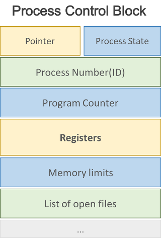

# 프로세스와 스레드

## 프로세스(Process)

프로세스는 실행 중인 프로그램으로 디스크로부터 메모리에 적재되어 CPU의 할당을 받을 수 있는 것을 말한다. 운영체제로부터 주소 공간, 파일, 메모리 등을 할당받으며 이것들을 총칭하여 프로세스라고 한다. 

메모리는 다음 4가지 영역들로 이루어져 있다.

- Code: 실행 명령을 포함하는 코드들
- Data: Static 변수 혹은 Global 변수
- Heap: 동적 메모리 영역
- Stack: 지역변수, 매개변수, 반환 값 등등 일시적인 데이터

__프로세스 제어 블록(PCB)__

PCB는 특정 프로세스에 대한 중요한 정보를 저장하고 있는 운영체제의 자료구조이다. 운영체제는 프로세스를 관리하기 위해 프로세스의 새성과 동시에 고유한 PCB를 생성한다. 프로세스는 CPU를 할당받아 작업을 처리하다가도 프로세스 전환이 발생하면 진행하던 작업을 저장하고 CPU를 반환해야 하는데, 이 때 작업의 진행 상황을 모두 PCB에 저장하게 된다. 그리고 다시 CPU를 할당받게 되면 PCB에 저장되어 있던 내영을 불러와 이전에 종료했떤 시점부터 다시 작업을 수행한다.

_PCB에 저장되는 정보_

- 프로세스 식별자(Process ID): 프로세스 식별번호
- 프로세스 상태: new, ready, running, waiting, terminated 등의 상태를 저장
- 프로그램 카운터: 프로세스가 다음에 실행할 명령어의 주소
- CPU 레지스터
- CPU 스케쥴링 정보: 프로세스의 우선순위, 스케줄 큐에 대한 포인터 등
- 메모리 관리 정보: 페이지 테이블 또는 세그먼트 테이블 등과 같은 정보를 포함
- 입출력 상태 정보: 프로세스에 할당된 입출력 장치들과 열린 파일 목록
- 어카운팅 정보: 사용된 CPU 시간, 시간제한, 계정번호 등

## 스레드(Thread)

스레드는 프로세스의 실행 단위라고 할 수 있다. 한 프로세스 내에서 동작되는 여러 실행 흐름으로 프로세스 내의 주소 공간이나 자원을 공유할 수 있다. 스레드 ID, 프로그램 카운터, 레지스터 집합, 스택으로 구성된다. 하나의 프로세스를 다수의 실행 단위로 구분하여 자원을 공유하고 자원의 생성과 관리의 중복성을 최소화하여 수행 능력을 향상시키는 것을 멀티스레딩이라고 한다.

__스택을 스레드마다 독립적으로 할당하는 이유?__

스택은 함수 호출시 전달되는 인자, 되돌아갈 주소값 및 함수 내에서 선언하는 변수 등을 저장하기 위해 사용되는 메모리 공간이다. 이를 독립적으로 할당한다는 것은 독립적인 함수 호출이 가능하다는 것이고 이는 독립적인 실행 흐름이 추가된다는 것, 따라서 최소 조건으로 독립된 스택을 할당

__PC Register를 스레드마다 독립적으로 할당하는 이유__

PC값은 스레드가 명령어의 어디까지 수행하였는지를 나타나게 된다. 스레드는 CPU를 할당 받았다가 스케줄러에 의해 다시 선점당한다. 그렇기 때문에 명령어가 연속적으로 수행되지 못하고 어느 부분까지 수행했는지 기억할 필요가 있다. 따라서 PC 레지스터를 독립적으로 할당

## 문맥 전환(Context Switching)

여러 개의 작업이 이루어질 때 동시에 이루어지는 것이 아니라 CPU를 시분할하여 각 프로세스를 번갈아가며 실행한다.

## 멀티 프로세스 & 멀티 스레드

__멀티 프로세스__

- 각 프로세스는 독립적
- IPC를 사용한 통신
- 자원 소모적이며 개별 메모리 차지
- Context Switching 비용이 큼
- 동기화 작업이 필요하지 않음
- 안정성이 높다.

__멀티 스레드__

- Thread끼리 긴밀하게 연결되어 있음
- 공유된 자원으로 통신 비용 절감
- 공유된 자원으로 메모리가 효율적
- Context Switching 비용이 적음(캐시 메모리를 비울 필요가 없기 때문)
- 공유 자원 관리 필요(동기화)

**동기화: 프로세스 또는 스레드들이 수행되는 시점을 조절하여 서로가 알고 있는 정보가 일치하는 것